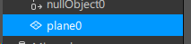
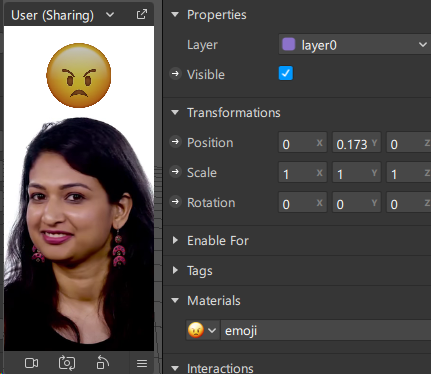
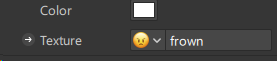
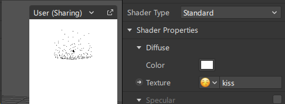
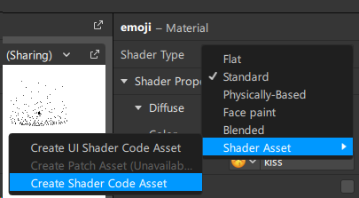
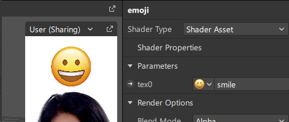

# Proiectul individual la Realitatea Virtuală și Augmentată

*Student:* **Curmanschii Anton, MIA2201**

## Introducere

Ideea mea este să avem un emoji pe ecran, și să repetăm emoția acestuia.

Pentru aceasta avem nevoie de:
1. Un set de imagini emoji;
2. O posibilitate de a le arăta pe ecran;
3. Posibilitatea de a recunoaște expresia feței utilizatorului;
4. Să conectăm aceste aspecte.


## 1. Set de imagini emoji

Am încercat pur și simplu să adaug un emoji ca text în elementul de text în editor,
însă acesta aparent nu le suportează.
Am încercat și diferite fonturi, nu joacă rolul.
Am căutat ceva referitor la această temă în docuri și pe Google, dar nu am găsit nimic util.

O altă abordare ar fi să folosim niște imagini sau modele 3D din biblioteca lor integrată.
Acolo nu este nici nu pachet care să includă tot ce am vrut eu, așa că pur și simplu
am descărcat niște imagini de pe net, primele imagini din Google.


## 2. O posibilitate de a le arăta pe ecran

Am menționat că nu-i posibil de făcut asta cu un element text.
De aceea am creat un plan, care am să-l folosesc pentru a desena imaginea:



După ce am creat un material, și am adăugat materialul acesta la plan:



Am setat ca textura la material una din texturile descărcate:



Însă lucrează doar cu angry face, alte imagini o băguiesc.




Încerc să folosesc un shader simplificat, poate aceasta o să-mi soluționeze problema:



```cpp
using namespace std;

vec4 main(Texture2d tex0) {
  vec2 uv = fragment(getVertexTexCoord());
  vec4 color = tex0.sample(uv);
  return color;
}
```

Editorul s-o băguit iarăși, arătându-mi shader-ul veche.
Am reîncărcat editorul.
Acum îmi arăta parametrile shader-ului veche creat inițial implicit.
Trebuia să schimb shader-ul la unul alt, după ce să-l schimb înapoi.
De amu mi-a arătat uniformul meu `tex0`.

> Am folosit [exemple](https://github.com/aferriss/sparksl-shader-examples/blob/master/4-image-effects/effects/shaders/pixelStretch.sca) pentru a găsi cum se face samplarea și cum se numește tipul de textură.

Acesta lucrează cum vrem:



Vedem încă problema că meta spark nu crează automat mipmap-uri
(sau este cauzat de altceva?),
de aceea textura apare pixelată.
Nu vreau să caut cum să fac asta.


## 3. Posibilitatea de a recunoaște expresia feței utilizatorului

Asta se poate face ori prin patch-uri, or prin cod, 
folosind modulul `FaceGestures` în cod.
După ce m-am jucat și mi-am bătut capul cu patch-uri,
am decis să folosesc totuși TypeScript-ul.
Patch-urile vor avea și probleme cu timing-uri în viitor,
care se rezolvă mult mai ușor prin cod.

Am definit un tip pentru toate emoțiile track-uite,
ca să folosim tipizarea în mod benefic:

```ts
class Emojis<T>
{
  smile: T;
  surprised: T;
  kiss: T;
  frown: T;
  [key: string]: T; // nu știu cum să fac tipul keyof Emojis<T>
                    // aproape nu cunosc TypeScript-ul
}
```

Mai departe, folosesc funcțiile de nivel înalt, deoarece nu vreau
să studiez cum lucrează modulul acesta sub capotă, cu toate că
astfel aș putea crea emoții într-un mod mai general.

```ts
const face = FaceTracking.face(0);

const observedStateSignals : Emojis<BoolSignal> = {
  smile: FaceGestures.isSmiling(face),
  surprised: FaceGestures.isSurprised(face),
  kiss: FaceGestures.isKissing(face),
  frown: FaceGestures.hasEyebrowsFrowned(face),
};
const stateKeys = Object.keys(observedStateSignals);
```


## 4. Să conectăm aceste aspecte 


La început am încercat să folosesc patch-urile,
dar deja am explicat la ce am ajuns cu timing-uri.

- Cu setarea texturilor tot nu este evident cum să fac asta:
  vrem să generăm un număr aleator care să reprezinte fața target curentă,
  însă cum să reprezint asta în patch-uri?

- Cum să generez un număr care nu este egal cu numărul curent?

- Cum să selectez textura după număr generat?
  Nu am găsit componenta "decoder".

- Cum să adaug în viitor mai multe emoji?
  Se așteaptă să duplic toată logică pentru fiecare element nou?

Sunt prea multe întrebări fără răspuns, de aceea fac prin cod.

### Codul esențial

În primul rând culeg toate referințele după nume:


```ts
let textures: Emojis<TextureBase>;
let emojiMaterial: MaterialBase;
{
  const textureKeys = stateKeys;
  const emojiMaterialKey = "emoji";
  const promises = [];
  {
    const t = Materials.findFirst(emojiMaterialKey);
    promises.push(t);
  }
  for (let key of textureKeys)
  {
    const t = Textures.findFirst(key);
    promises.push(t);
  }
  const objects = await Promise.all(promises);
  emojiMaterial = objects[0];

  {
    textures = new Emojis<TextureBase>();
    for (let i = 0; i < textureKeys.length; ++i)
    {
      const key = textureKeys[i];
      textures[key] = objects[i + 1];
    }
  }
}
```

Aștept ca semnalele gesturilor nu vor fi stabile,
așa că am vrut să adaug imediat puțin debouncing.
Nu am găsit o funcție pentru asta, de aceea am implementat-o cu un timer.

```ts
const observedTimeoutMilliseconds : ScalarSignal = 
  await Patches.outputs.getScalar("observedTimeoutMilliseconds");

const stateSignals = new Emojis<BoolSignalSource>();
for (let key of stateKeys)
{
  const signal = Reactive.boolSignalSource(key);
  stateSignals[key] = signal;

  const sourceSignal = observedStateSignals[key];
  signal.set(sourceSignal.pinLastValue());
}

for (var [key, signal] of Object.entries(observedStateSignals))
{
  const copy = key;

  // No built-in debounce function? wth?
  let timeout : NodeJS.Timeout = null;
  signal
    .monitor()
    .subscribe(event => {
      if (timeout != null)
      {
        clearTimeout(timeout);
        timeout = null;
        return;
      }
      timeout = setTimeout(() => {
        stateSignals[copy].set(event.newValue);
        timeout = null;
      }, observedTimeoutMilliseconds.pinLastValue());
    });
}
```

### Debugging

Mai am adăugat ceva cod, pentru acum nu importă.
Scriptul se compilează și se rulează, dar se crășează undeva, zice `Unavailable API`.
Am încercat să fac debugging cu extensiunea din VS Code, dar nu merge debugging-ul.
Am căutat cum să soluționează, informații absolut nu sunt.
Ok dar, am să adaug niște `Diagnostic.log` să caut pe ce linie dă crash.

Eroarea apare la:
```ts
const signal = Reactive.boolSignalSource(key);
```

Sincer nu am idei cum să realizez ideea fără această funcție.
Așa că acum eu sunt în impas, și în plus sunt frustrat de experiență cu aplicația,
am să mă opresc aici.

### Restul codului

Arăt și restul logicii.
Vom avea nevoie de o constantă care indică cât timp
gestul feței să fie activ ca să se socoată:

```ts
const scoredTimeoutMilliseconds : ScalarSignal =
  await Patches.outputs.getScalar("scoredTimeoutMilliseconds"); 
```

Vom mai ține cont de starea curentă, adică emoji selectat la moment.

```ts
const currentState = Reactive.stringSignalSource("currentState");
{
  const randomKeyIndex = randomInt(0, stateKeys.length);
  const randomKey = stateKeys[randomKeyIndex];
  currentState.set(randomKey);
}
```

Și acum logica principală.
Nu știu dacă are bug-uri sau nu, execuția nu ajunge acolo din cauza erorii, menționate anterior.

- Fiecare dată când se schimbă ținta curent (cheia emoji-ului),
  ceea ce se întâmplă când se resetează ținta după un succes,
  resetăm textura din imagine să arată imaginea care corespunde țintei curente
  (emoji respectiv).

- Inițializăm un event handler care va fi invocat când ținta se schimbă.
  Acesta resetează din nou ținta la un număr aleator nou, dacă
  variabila gestului feței indică gestul țintă pentru o perioadă de timp.

```ts
{
  let latestSubscription : Subscription = null;
  let stateSetTimeout : NodeJS.Timeout = null;
  currentState
    .signal
    .monitor({ fireOnInitialValue: true })
    .subscribe(async event => {
      const texture = textures[event.newValue];
      emojiMaterial.setTextureSlot("tex0", texture.signal);

      if (latestSubscription != null)
      {
        latestSubscription.unsubscribe();
      }
      if (stateSetTimeout != null)
      {
        clearTimeout(stateSetTimeout);
        stateSetTimeout = null;
      }

      const signal = stateSignals[event.newValue].signal;
      latestSubscription = signal
        .monitor({ fireOnInitialValue: true })
        .subscribe(event => {
          if (event.newValue == false)
          {
            if (stateSetTimeout != null)
              clearTimeout(stateSetTimeout);
          }
          else
          {
            stateSetTimeout = setTimeout(() => {
              stateSetTimeout = null;

              let currentRandomKey = currentState.signal.pinLastValue();
              let newRandomKey;
              do
              {
                const randomKeyIndex = randomInt(0, stateKeys.length);
                newRandomKey = stateKeys[randomKeyIndex];
              }
              while (currentRandomKey == newRandomKey);
              currentState.set(newRandomKey);
            }, scoredTimeoutMilliseconds.pinLastValue());
          }
        });
    });
}
```